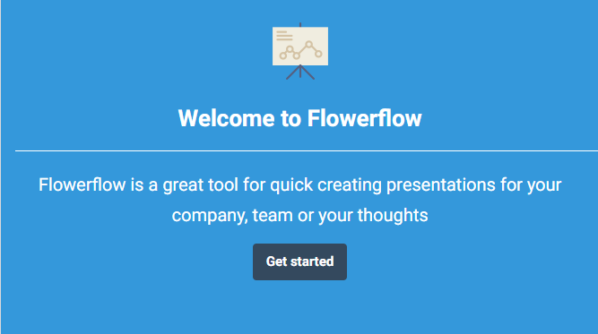
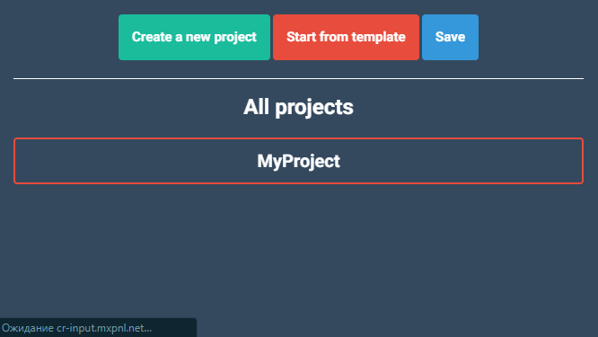
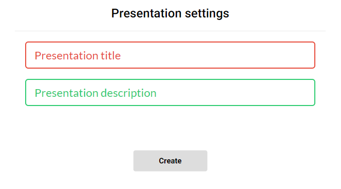

# FlowerFlow-Mobile-Version
Application for creating presentations

I want to create an app for creating presenations (like power point by Microsoft, but to make something special to make it different in some ways)

Make sure you have [ionic](https://ionicframework.com/) installed on your PC. Unzip this project to any folder and locate to this folder using your command line. **ionic serve** will open the app in browser. **F12** will open dev tools, there you can enable mobile view to view the app from Android and Apple devices.  

[Pc version](https://github.com/danmoop/FlowerFlow-PC-Version)

